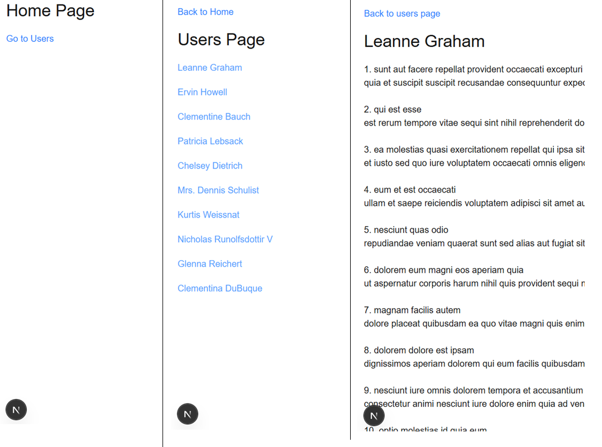

# Lesson 2: Fetching Data in Next.js

In this lesson, the focus is on understanding how to work with async server components, dynamic routing, and React’s Suspense for better user experience.

## 1. Server Components & Async Data

All the data-fetching logic lives inside the lib folder. Each file (`getAllUsers.ts`, `getUser.ts`, `getUserPosts.ts`) uses the native fetch API to retrieve data from a placeholder API. These functions are then used in server components to fetch and render content.

## 2. Suspense for Async UI

In the page.tsx of the [userId] route, instead of fetching both user and posts data in parallel using Promise.all, I used React’s Suspense to handle the posts asynchronously:

```tsx
const userData: Promise<User> = getUser(userId);
const userPostsData: Promise<Post[]> = getUserPosts(userId);

// const [user, userPosts] = await Promise.all([userData, userPostsData]);
const user = await userData;

return (
  <>
    <h2>{user.name}</h2>
    <br />
    <Suspense fallback={<h2>Loading ...</h2>}>
      <UserPosts promise={userPostsData} />
    </Suspense>
  </>
);
```

This allowed the user details to render immediately, while the posts are loaded lazily with a fallback.

## 3. Type Definitions:

I used a types.d.ts file to define the types used throughout the project, ensuring type safety and better developer experience:

## 4. File Naming for Dynamic Routes

Next.js uses **file-based routing**, and dynamic segments are defined using square brackets:

**Example:**

- /users/[userId]/page.tsx → handles routes like /users/1, /users/2

- This is cleaner and more scalable than manually handling query parameters.

## 5. Dynamic vs Static Route

| Type    | Example                   | Use Case                                           |
|---------|---------------------------|----------------------------------------------------|
| Dynamic | `/post/[postId]/page.tsx` | Preferred for individual content (e.g., blog posts) |
| Static  | `/post/page.tsx`          | Less flexible, requires manual query parsing for post ID |

## 6. Demo


