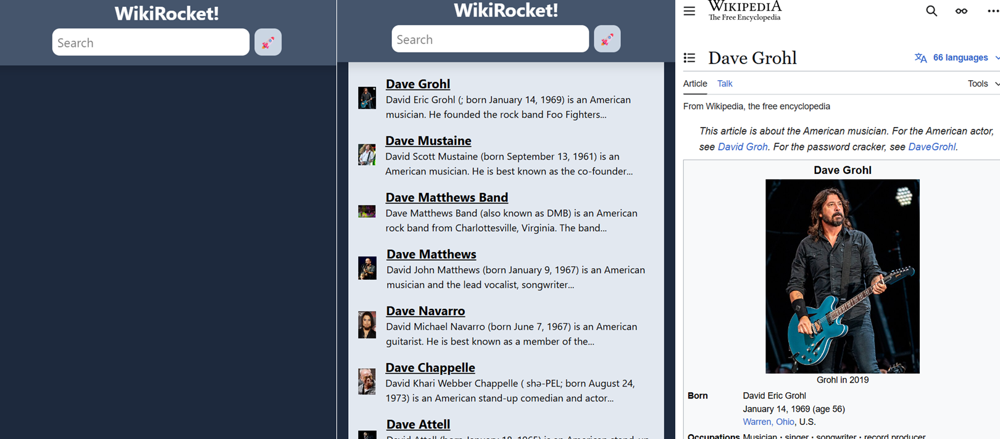

# Lesson 4: Wiki Search Web App

This project is a simple Wiki Search Web Application built using Next.js. It allows users to search Wikipedia directly from the interface and displays a list of search results with summaries and links to full articles.

## 1. Features

- Search input with real-time query handling
- Displays top Wikipedia search results with title and snippet
- Responsive and clean UI
- Error and loading states for better UX
- Modular component-based architecture

## 2. Built With

- Next.js – React framework for server-rendered applications
- TypeScript – Strongly typed programming language
- Wikipedia API – To fetch search results
- Tailwind CSS – For styling

## 3. Project Structure Overview

- components/ – Reusable UI components (e.g., Navbar, Search bar, Item cards)
- lib/ – Utility functions, such as the Wikipedia search API handler

## 4. Notes

### 4.1 Server Components

**Rendered on the server and sent as static HTML to the browser.**

---

**Pros:**

- **Faster initial load:** HTML is pre-rendered.
- **Smaller bundle size:** No need to send JavaScript to the client for server-rendered parts.
- **Better for SEO:** Since content is fully rendered on the server.
- **Access to server-only resources:** Like databases or private APIs directly.

---

**Cons:**

- Cannot use React hooks like `useState`, `useEffect`.
- Cannot directly handle browser events (e.g., `onClick`).
- Must be pure and asynchronous (cannot rely on client-only features).

---

**Example use:**

```tsx
// Automatically a Server Component (no "use client")
export default async function ProductsPage() {
  const products = await fetchProducts(); // server-side data fetching
  return <ProductList products={products} />;
}
```

### 4.2 Client Components

**Rendered on the client (browser), like traditional React components.**

---

**Pros:**

- Can use React state, lifecycle hooks, event listeners (`onClick`, `onChange`, etc.).
- Required for interactive UI elements.

---

**Cons:**

- Increases JavaScript bundle size.
- Slower interactivity if overused.
- Needs hydration (browser re-renders with JS after page load).

---

**Example use:**

```tsx
"use client";

import { useState } from "react";

export default function Counter() {
  const [count, setCount] = useState(0);
  return <button onClick={() => setCount(count + 1)}>{count}</button>;
}
```

## 5. Demo


