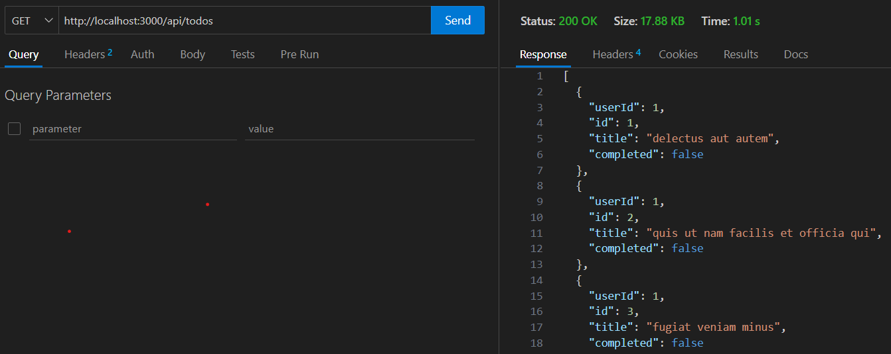
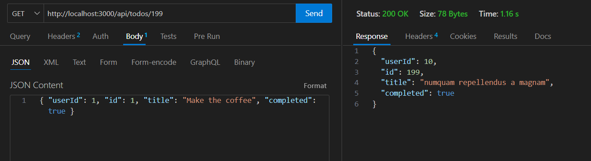
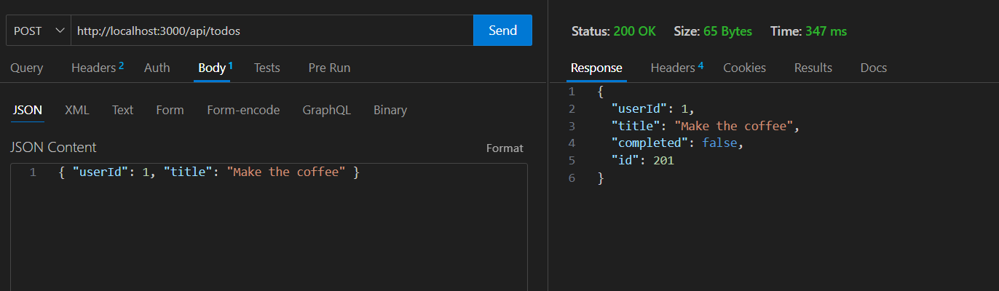
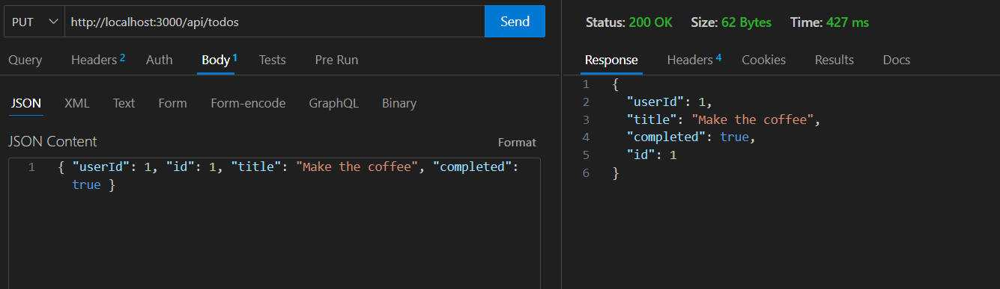
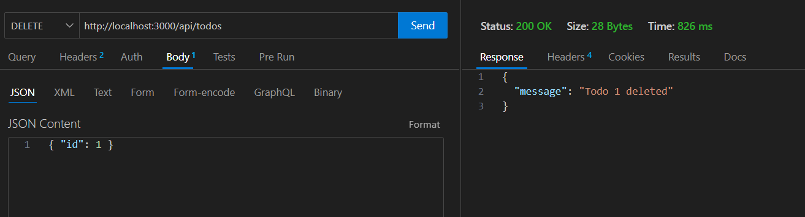

# Lesson 8: REST API

In this lesson, we will dive into building a REST API using Next.js. Next.js, by default, provides a powerful API routes feature, which allows us to create backend endpoints alongside our frontend pages.

This guide will walk you through setting up a simple todo application with API endpoints for managing todos, including creating, reading, updating, and deleting them.

## 1. API Routes

In Next.js, API routes are located in the `pages/api` directory. Each file in this directory corresponds to an API endpoint. When the file is accessed via an HTTP request, Next.js will automatically invoke the file as a handler for that request.

### HTTP Methods:

- **GET**: Retrieve data from the server (e.g., get todos)
- **POST**: Create a new resource (e.g., add a new todo)
- **PUT/PATCH**: Update an existing resource (e.g., mark a todo as completed)
- **DELETE**: Remove a resource (e.g., delete a todo)

## 2. GET request

Fetches all todos from the external data source (`jsonplaceholder.typicode.com`). The response is returned in JSON format.

**For example:**

```ts
export async function GET() {
  const res = await fetch(DATA_SOURCE_URL);

  const todos: Todo[] = await res.json();

  return NextResponse.json(todos);
}
```



## 3. GET Specfic Id Request

**For example:**

```ts
export async function GET(request: Request) {
  const id = request.url.slice(request.url.lastIndexOf("/") + 1);

  const res = await fetch(`${DATA_SOURCE_URL}/${id}`);

  const todo: Todo = await res.json();

  if (!todo.id) return NextResponse.json({ message: "Todo not found" });

  return NextResponse.json(todo);
}
```



## 4. POST Request

Accepts a `userId` and `title` from the request body, then sends a POST request to create a new todo in the external data source. The newly created todo is returned in the response.

**For example:**

```ts
export async function POST(request: Request) {
  const { userId, title }: Partial<Todo> = await request.json();

  if (!userId || !title)
    return NextResponse.json({ message: "Missing required data" });

  const res = await fetch(DATA_SOURCE_URL, {
    method: "POST",
    headers: {
      "Content-Type": "application/json",
      "API-Key": API_KEY,
    },
    body: JSON.stringify({
      userId,
      title,
      completed: false,
    }),
  });

  const newTodo: Todo = await res.json();

  return NextResponse.json(newTodo);
}
```



## 5. PUT Request

Accepts the `userId`, `id`, `title`, and `completed` status from the request body to update an existing todo in the external source. If the todo is updated successfully, the updated todo is returned.

**For example:**

```ts
export async function PUT(request: Request) {
  const { userId, id, title, completed }: Todo = await request.json();

  if (!userId || !id || !title || typeof completed !== "boolean")
    return NextResponse.json({ message: "Missing required data" });

  const res = await fetch(`${DATA_SOURCE_URL}/${id}`, {
    method: "PUT",
    headers: {
      "Content-Type": "application/json",
      "API-Key": API_KEY,
    },
    body: JSON.stringify({
      userId,
      title,
      completed,
    }),
  });

  const updatedTodo: Todo = await res.json();

  return NextResponse.json(updatedTodo);
}
```



## 6.DELETE Request

Accepts the id of the todo to be deleted and sends a DELETE request to remove the todo from the external source. A message indicating successful deletion is returned.

**For example:**

```ts
export async function DELETE(request: Request) {
  const { id }: Partial<Todo> = await request.json();

  if (!id) return NextResponse.json({ message: "Todo id required" });

  await fetch(`${DATA_SOURCE_URL}/${id}`, {
    method: "DELETE",
    headers: {
      "Content-Type": "application/json",
      "API-Key": API_KEY,
    },
  });

  return NextResponse.json({ message: `Todo ${id} deleted` });
}
```


